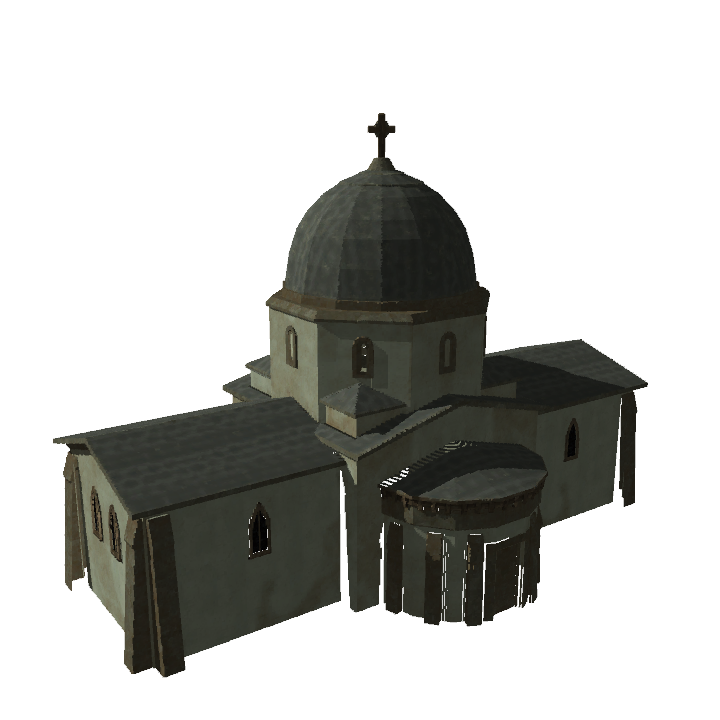
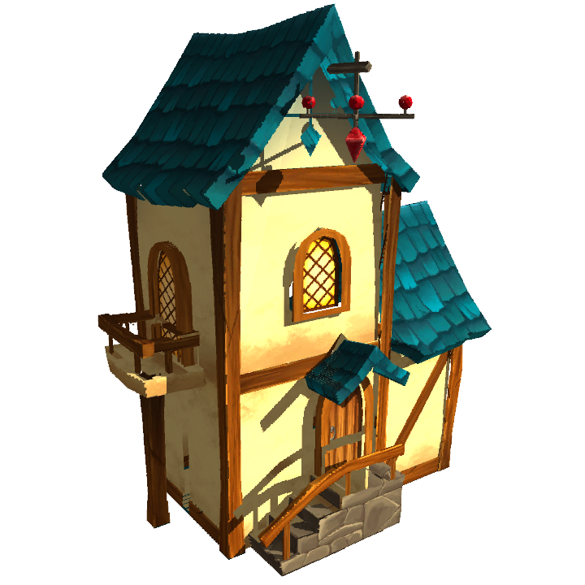
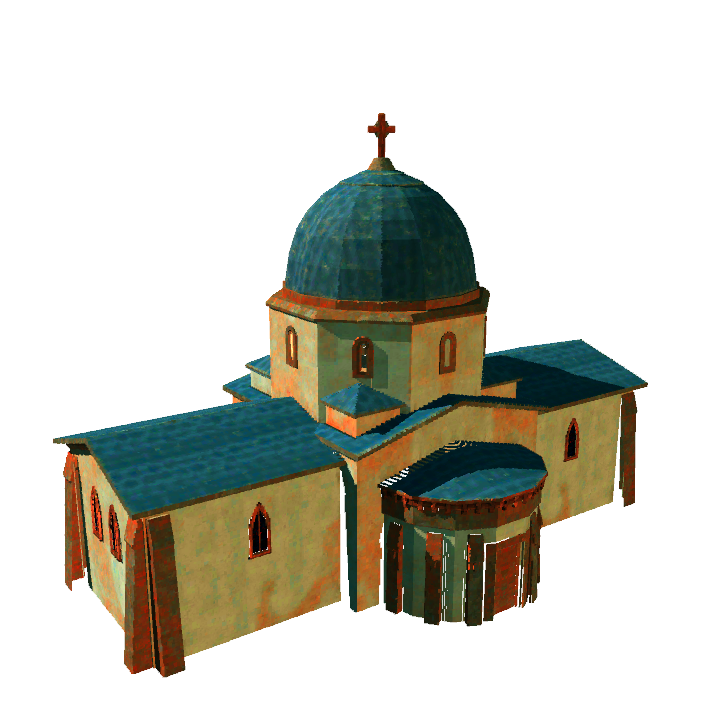
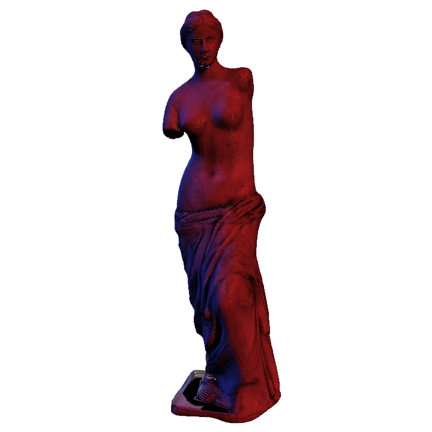
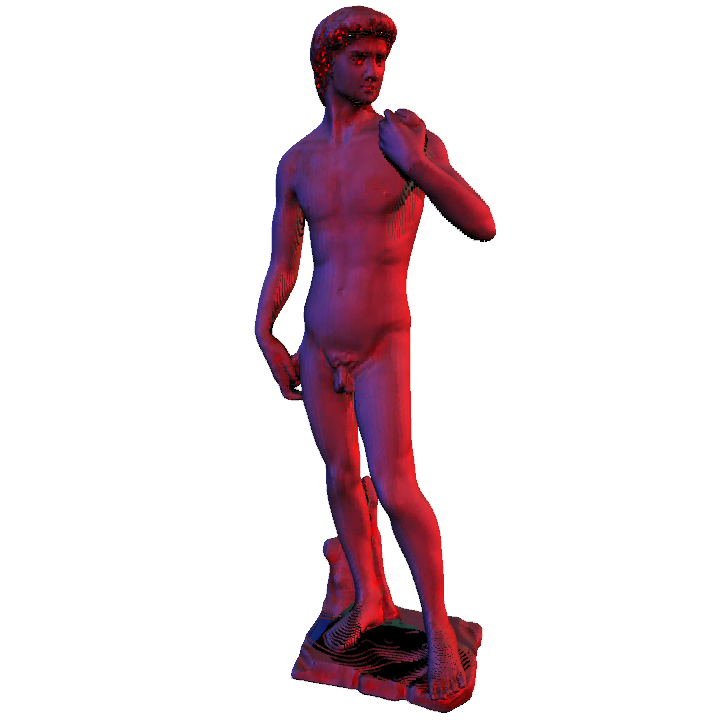

# Example-based colour transfer for 3D point clouds

Unity project of [Example-based colour transfer for 3D point clouds](https://hal.archives-ouvertes.fr/hal-02301430).

> "Example-Based Colour Transfer for 3D Point Clouds; I. Goudé, R. Cozot, O. Le Meur, K. Bouatouch; Computer Graphics Forum (2021); https://doi.org/10.1111/cgf.14388"

## Requirements

Unity 2019.2.4f1

## Results
In this paper, we propose a new framework to automatically transfer the color style from a target point cloud to an input point cloud.
Our proposed color transfer methods rely on correlations between the color distributions and the geometry of the models.

<html>
    <body>
        

            
            
             
        

    </body>
</html>
Rendering the church point cloud (left) with the color style of the fantasy house point cloud (middle) gives the output point cloud (right).

<html>
    <body>
        

            
            
             
        

    </body>
</html>
Another example, from left to right: input point cloud, target style point cloud, output point cloud.

## Contact

> PERCEPT Team - IRISA Rennes  
Email: percept@irisa.fr

> Ific Goudé  
PhD student  
Team Percept - IRISA  
Email: ific.goude@irisa.fr
